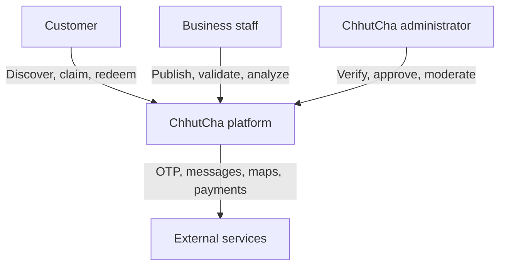
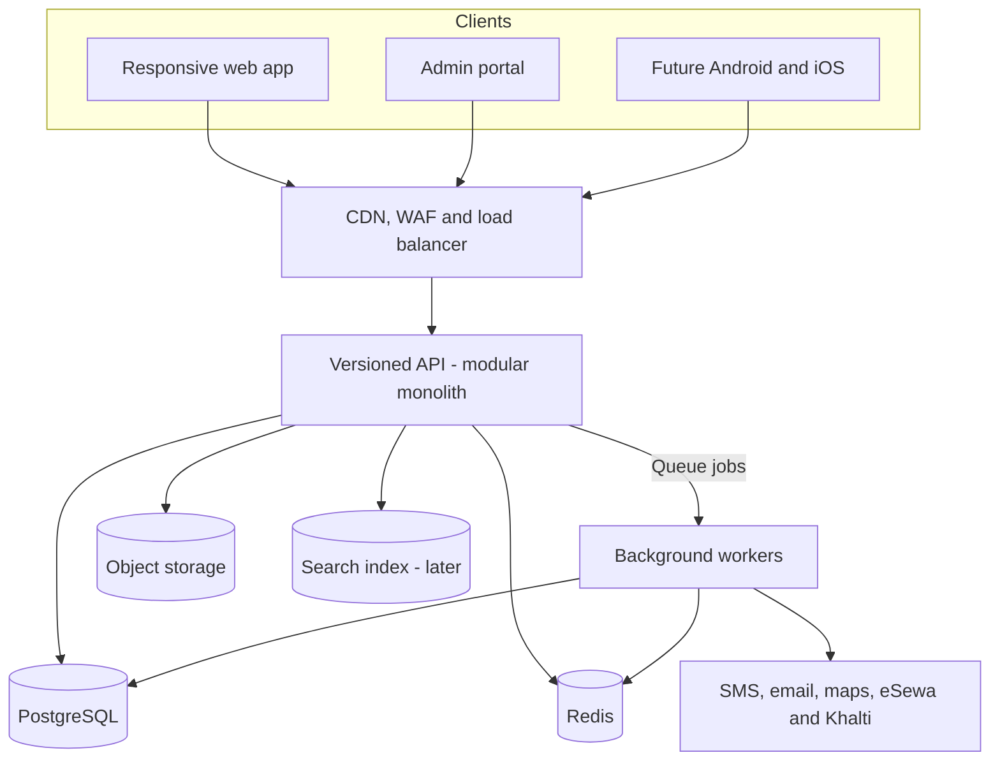
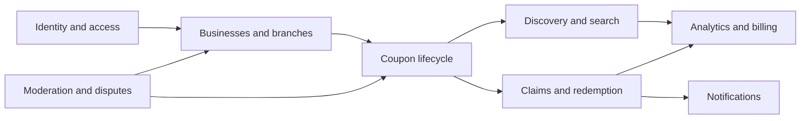
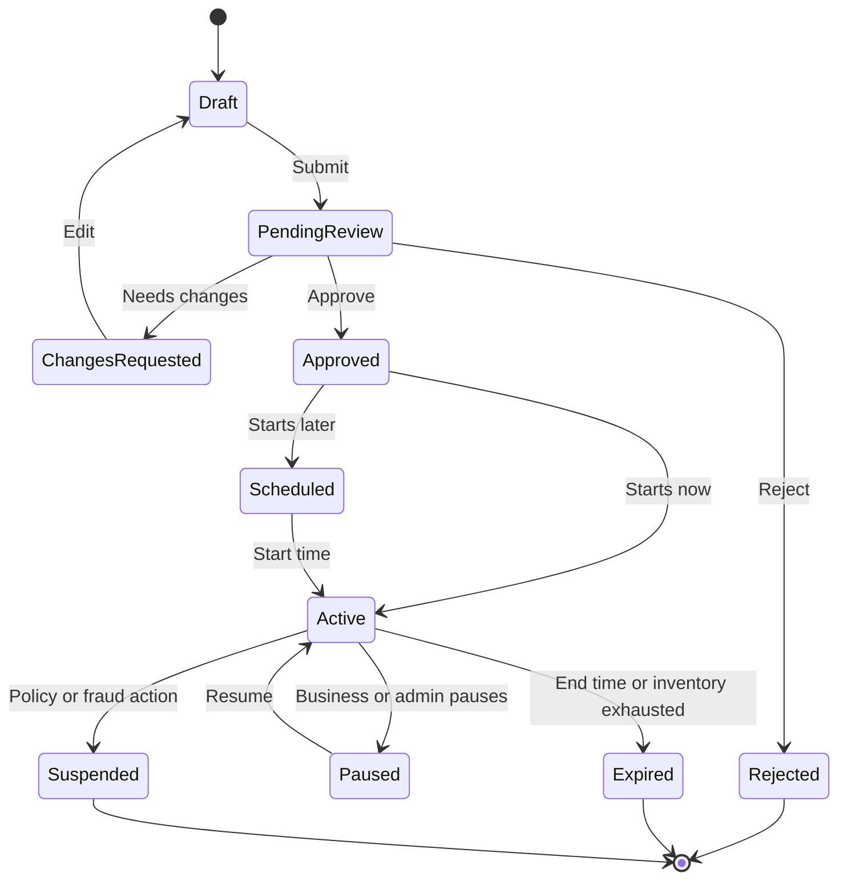
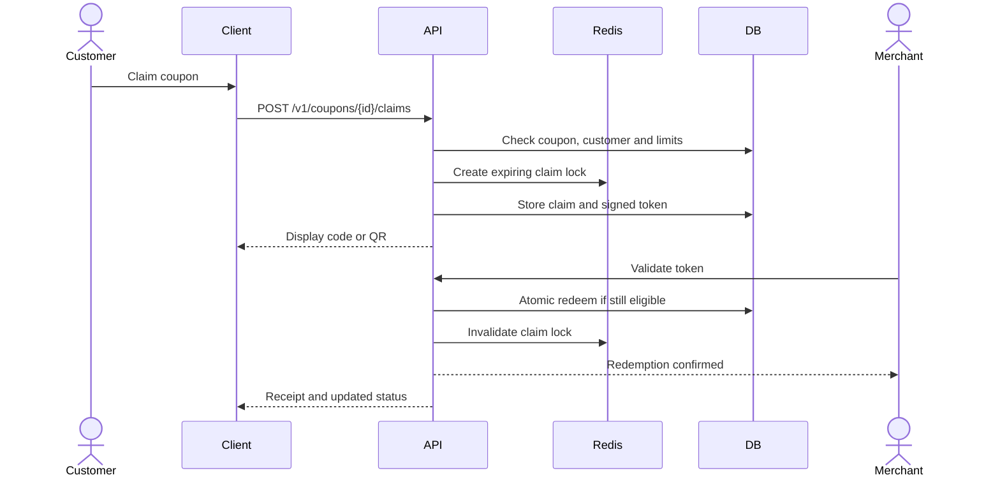
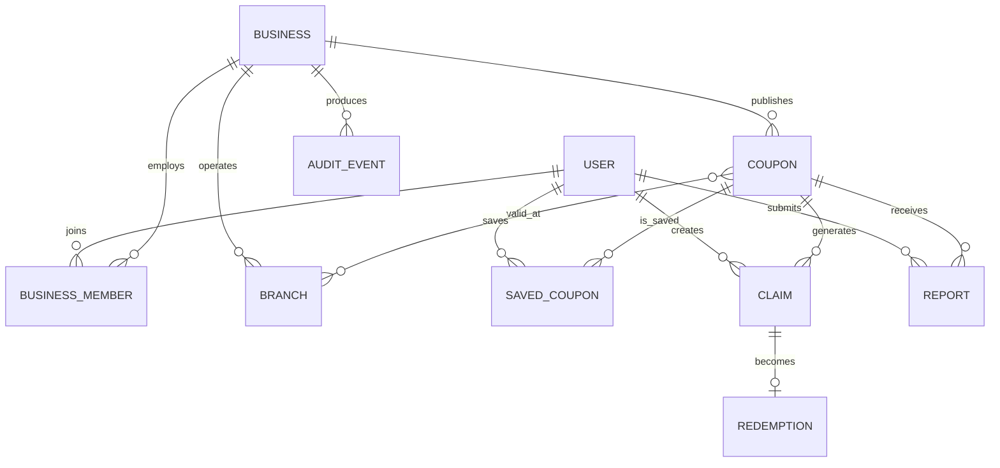
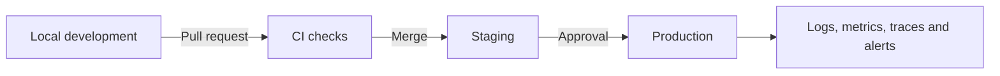

# ChhutCha Technical Architecture

This document describes the proposed starting architecture for ChhutCha. The system begins as a modular monolith and is designed to support a responsive web product first, followed by Android and iOS clients through the same versioned API.

## System context

## Container architecture

## Application modules

Modules share one deployment and database initially, but communicate through defined application interfaces and domain events. A module must not directly own or mutate another module's tables.

## Core responsibilities

| Module | Responsibilities |
|---|---|
| Identity and access | Registration, phone/email OTP, sessions, roles, permissions, account recovery |
| Businesses and branches | Business profiles, PAN/VAT/KYC verification, staff, branches, hours, online presence |
| Coupon lifecycle | Offer types, rules, terms, inventory, scheduling, approval, publishing, expiry |
| Discovery and search | Categories, keywords, location, online/local filters, ranking, featured deals |
| Claims and redemption | Eligibility, unique codes, QR tokens, atomic redemption, limits, fraud signals |
| Moderation and disputes | Reviews, reports, approvals, audit trail, suspension, customer/business disputes |
| Notifications | OTP, approval status, saved-deal alerts, expiry reminders, redemption receipts |
| Analytics and billing | Views, claims, conversions, merchant insights, plans, featured placement |

## Coupon lifecycle

## Redemption sequence

The final write must use a database transaction, row-level constraint or equivalent atomic operation, and an idempotency key. A screenshot of a QR code must not be sufficient to redeem repeatedly.

## Initial data model

Additional supporting entities will include categories, locations, media, verification documents, notification preferences, plans, subscriptions, and analytics events.

## API outline

All public clients use a versioned interface such as `/api/v1`.

| Area | Example endpoints |
|---|---|
| Authentication | `POST /auth/otp/request`, `POST /auth/otp/verify`, `POST /auth/logout` |
| Discovery | `GET /coupons`, `GET /coupons/{slug}`, `GET /businesses/{slug}` |
| Customer | `POST /coupons/{id}/save`, `POST /coupons/{id}/claims`, `GET /me/claims` |
| Business | `POST /businesses`, `POST /businesses/{id}/coupons`, `GET /businesses/{id}/analytics` |
| Redemption | `POST /redemptions/validate`, `POST /redemptions/confirm` |
| Admin | `GET /admin/review-queue`, `POST /admin/coupons/{id}/decision` |

OpenAPI should be the source of truth for validation, documentation, and generated mobile/web client types.

## Deployment environments

CI should run formatting, linting, type checks, unit tests, API contract tests, migration checks, dependency scanning, and builds. Production deployments should use backward-compatible migrations and a tested rollback procedure.

## Reliability and security controls

- CDN/WAF, TLS, secure headers, request-size limits, and API rate limits
- Passwordless OTP or securely hashed credentials with multi-factor support for privileged roles
- Role- and business-scoped authorization on every protected action
- Encrypted secrets and restricted verification-document access
- Signed short-lived redemption tokens and replay protection
- Transactional inventory and per-user usage enforcement
- Immutable audit events for sensitive business and admin actions
- Automated backups with recovery drills
- Structured logging without OTPs, tokens, or personal documents
- Health checks, service-level indicators, tracing, and actionable alerts
- Dependency, container, and application security scanning

## Scale path

Do not split services prematurely. Scale the stateless API and workers horizontally first. Introduce read replicas, a dedicated search index, CDN image transformations, and queue partitions based on measured load.

Likely future extraction candidates are:

1. Search and recommendations
2. Notifications
3. Analytics ingestion
4. Redemption and fraud controls
5. Billing

Extraction should follow observed bottlenecks, independent release needs, or security boundaries—not projected traffic alone.

## Nepal-specific integration considerations

- Normalize Nepali phone numbers and support reliable OTP providers.
- Store Nepal time explicitly and test coupon boundaries in `Asia/Kathmandu`.
- Support province, district, municipality, and branch-level discovery.
- Design for Nepali and English text, including Unicode search.
- Allow merchant-side redemption fallback for intermittent connectivity with strict reconciliation controls.
- Treat eSewa and Khalti as optional payment integrations; the coupon MVP need not hold customer funds.
- Validate PAN/VAT/KYC, privacy, tax, advertising, and consumer-protection requirements before launch.

## Architecture decisions to record next

- ADR-001: Modular monolith for MVP
- ADR-002: Authentication and OTP provider
- ADR-003: Claim and redemption token design
- ADR-004: Search implementation and ranking
- ADR-005: Hosting region and deployment platform
- ADR-006: Offline merchant redemption policy
- ADR-007: Payment boundary and monetization
